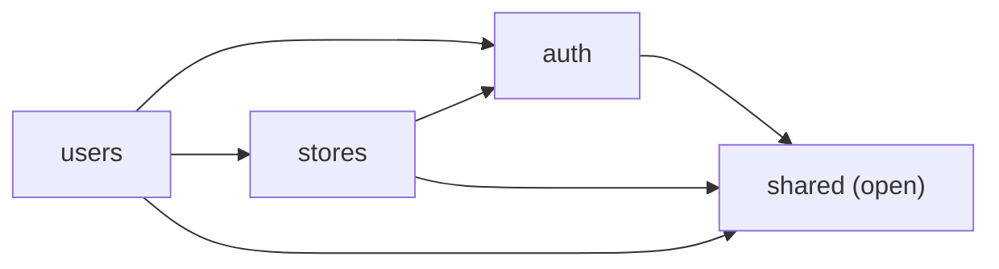

# talon-core

Spring Boot BFF for Talon. The browser holds an httpOnly session cookie, never
a Keycloak token. Cluster manifests live in `webb1es/gitops` (`workloads/talon`).

```bash
docker compose up -d          # local Postgres :5432
mvn spring-boot:run           # :9095
```

Export (or set) the vars below. Point `KC_*` at
`https://test-auth.webbies.dev` (realm `talon`) or a local Keycloak.

No Dockerfile / GHCR workflow yet. gitops still pins
`ghcr.io/webb1es/talon-core:bootstrap`.

## Env

| Variable | Purpose |
|---|---|
| `SERVER_PORT` | Default `9095` |
| `SPRING_DATASOURCE_URL` | JDBC URL. Local: `jdbc:postgresql://localhost:5432/talon`. In-cluster: CNPG secret key `jdbc-uri` (not `uri`) |
| `SPRING_DATASOURCE_USERNAME` / `PASSWORD` | Local: `talon` / `password`. In-cluster: CNPG `talon-pg-app` |
| `KC_ISSUER` | `https://<keycloak>/realms/talon` |
| `KC_CORE_CLIENT_ID` / `KC_CORE_CLIENT_SECRET` | Confidential login client `talon-core` |
| `KC_ADMIN_CLIENT_ID` / `KC_ADMIN_CLIENT_SECRET` | Service account `talon-core-admin` |
| `KC_ADMIN_API_BASE` | `{server}/admin/realms/talon` — not `{issuer}/admin` |
| `FRONTEND_URL` | SPA origin (logout redirect + post-login) |
| `CORS_ALLOWED_ORIGINS` | Comma-separated; credentials required, so not `*` |

Realm import (clients, roles, service account — not users) is
`gitops/workloads/keycloak-test/talon-realm.yaml`. Copy generated client secrets
into gitops secret `talon-core-kc`. Logout redirect must exact-match
`FRONTEND_URL + "/login"` in that import.

## Architecture

talon-core is a single deployable Spring Boot app organized as a
[Spring Modulith](https://spring.io/projects/spring-modulith) — several
independent modules in one JAR, each with an enforced boundary, instead of
either a tangled monolith or a fleet of microservices.

### Module map

Every direct sub-package of `com.talon.core` is an application module. A
module's **root package is its public API**; everything under `internal/` is
implementation detail no other module may import.



| Module | Allowed dependencies | Publishes (Ports) | Owns |
|---|---|---|---|
| `auth` | *(none)* | `KeycloakAdminPort`, `PinCredentialsPort`, `PinVerificationPort`, `UserAccountPort` | OIDC session, Keycloak admin HTTP, PIN verification |
| `stores` | `auth`, `shared` | `StorePort`, `StoreMemberPort` | Store CRUD |
| `users` | `auth`, `stores`, `shared` | *(none — only implements other modules' ports)* | Accounts, team, PIN hash storage, store membership |
| `shared` | *(open — importable by everyone)* | `ProblemDetail` handling, `ItemsResponse`, `/healthz`, `/readyz` | Cross-cutting HTTP kernel |

`auth` sits at the bottom of the graph on purpose: it has zero dependencies on
other Talon modules, so it can never accidentally depend on data it doesn't
own. `users` sits at the top because it's the module most likely to need
facts owned elsewhere (a store's name, a Keycloak identity).

### Package layout

Every module follows the same shape:

```
com/talon/core/<module>/
  package-info.java          @ApplicationModule(allowedDependencies = {...})
  <Capability>Port.java      published interface(s) — only if another module needs this data
  internal/
    entity/     <Aggregate>.java, ...            JPA entities
    repository/ <Aggregate>Repository.java       extends JpaRepository — only derived-query methods
    dto/        Create<X>Request, <X>Response     request/response records
    service/    <Aggregate>Service.java           the module's own business logic
                <Capability>Adapter.java          implements another module's Port
    web/        <Aggregate>Controller.java        REST endpoints
```

### Naming convention

| Role | Name pattern | Example |
|---|---|---|
| Published interface — a contract another module is allowed to call | `<Capability>Port` | `StorePort`, `PinCredentialsPort` |
| A module implementing **its own** Port | `<Aggregate>Service` | `StoreService implements StorePort` |
| A module implementing **another module's** Port (cross-module SPI) | `<Capability>Adapter` | `StoreMemberAdapter implements stores.StoreMemberPort`, living in `users` |

**Only publish a Port when another module actually needs it.** A module with
no external callers needs zero root-package interfaces. Keep each Port narrow
— one to three methods, one clear responsibility — rather than one fat
interface per module; that's what lets `users` depend on exactly the sliver
of `stores` it needs instead of all of it.

### Why this matters

Without the module boundary, a call like "does this store have members" would
just reach into whichever repository has the answer, and every module would
slowly become able to touch every other module's tables. With it:

- `stores` can change `Store`'s internals freely as long as `StorePort`'s
  contract doesn't change — nothing outside `stores.internal` can be coupled
  to it, because nothing outside `stores.internal` can even see it.
- Cross-module reads/writes are visible at a glance: grep for `implements
  *Port` outside a module's own package and you've found every place another
  module reaches in.
- The boundary isn't just convention — it's a build gate. `ModularityTests`
  runs `ApplicationModules.verify()` (via ArchUnit) as part of `mvn test` and
  fails the build if any module imports another module's `internal` package.

### Adding a new module (e.g. `suppliers`, `products`)

1. Create `com/talon/core/<module>/package-info.java` with
   `@ApplicationModule(allowedDependencies = {...})`.
2. Build out `internal/entity`, `internal/repository`, `internal/dto`,
   `internal/service`, `internal/web` as needed.
3. Only if another module needs this module's data: add a `<Capability>Port`
   interface at the module root, and implement it from `<Aggregate>Service`
   (own module) or a `<Capability>Adapter` (implementing module).
4. Run `mvn test` — `ModularityTests` will fail loudly if the boundary is
   violated.

## Deploy

Bump the image tag in `gitops/workloads/talon/rollout.yaml`. Canary 25→50→75,
Prometheus success-rate ≥ 95%. Sessions are JDBC (2 replicas + traffic split).

## Gotchas

- Confidential client: Spring `oauth2Login` does not send PKCE.
- Roles come from the ID token / userinfo (custom mapper), not the default
  access-token-only `roles` scope.
- CSRF is off; SameSite=Lax is the defense (SPA and API share `mytalon.co.zw`).
- A Keycloak login with no local `users` row is 403, not auto-provisioned.
- `tadmin` is reconciled at boot: missing Keycloak user, missing local row, or
  a mismatched `keycloakId` is created/linked. First password is an app default;
  Keycloak forces a change on first login. No-op if both already match, or if
  Keycloak is down. Staff users are created from the app only — not in the
  realm import.
- Swagger is `super_admin` only.
- Unauthenticated `/api/**` calls return 401 JSON (`ProblemDetail`). Browser navigations still redirect to Keycloak.
- `/readyz` and `/healthz` check the database and return 503 if it isn't reachable.
- `ddl-auto: create-drop` is on in `application.yml` (dev). Tests use `update` on H2.
